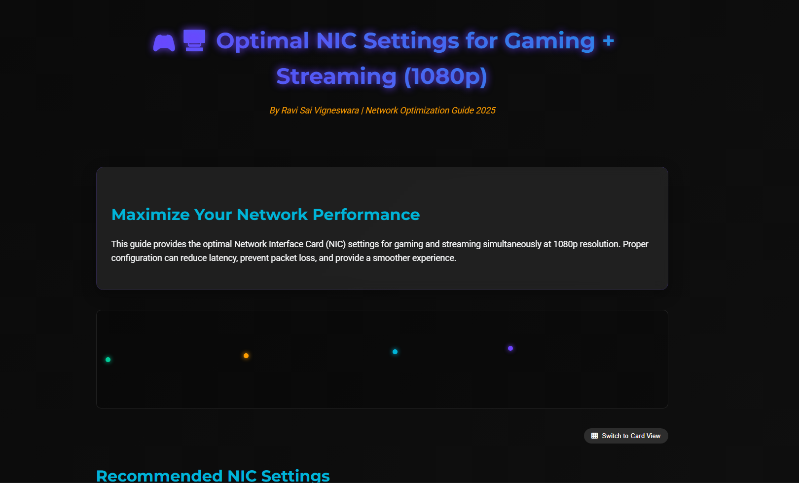

# 🌐 Ultimate Network Optimization Guide 2025

A stunning, interactive guide to optimal NIC settings for gaming and streaming. This single-page application provides comprehensive network configuration recommendations with beautiful animations and visual design.

 
 




## 🚀 Features

- **Stunning Visual Design**: Modern dark theme with gradient accents perfect for gaming/streaming aesthetics
- **Interactive Animations**: 
  - Data packets moving across the screen
  - Glowing text effects
  - Fade-in animations on scroll
  - Hover effects on interactive elements
- **Dual View Options**: Toggle between table view and card view
- **Responsive Design**: Works perfectly on mobile, tablet, and desktop
- **Visual Status Indicators**: Color-coded settings (green for enabled, red for disabled)
- **Comprehensive Guide**: All NIC settings with explanations and recommendations

## 📋 Recommended Settings Include

- Advanced EEE → Disabled (reduces latency spikes)
- Flow Control → Enabled (prevents packet loss)
- Interrupt Moderation → Disabled (lowers latency for gaming)
- Jumbo Frame → Disabled (unless LAN use)
- And 18+ more essential settings...

## 🛠️ Installation

Simply download the `index.html` file and open it in any modern browser. No additional dependencies required!

```bash
# Clone or download the repository
git clone https://github.com/yourusername/network-optimization-guide.git

# Open the index.html file in your browser
open index.html
📱 Usage
Open the guide in your browser

Browse through the recommended settings

Use the toggle button to switch between table and card views

Implement the suggestions in your network adapter settings

Check out the bonus tips for additional optimization ideas

🎨 Customization
The design is built with pure HTML, CSS, and JavaScript. Easily customize by modifying:

Color scheme in the :root CSS variables

Animation timing in the CSS keyframes

Content in the HTML structure

🌟 Bonus Tips
The guide also includes essential bonus tips such as:

Updating network drivers from manufacturer websites

Using Ethernet over Wi-Fi for stable connections

DNS optimization with Cloudflare or Google DNS

And more...

🗂️ Project Structure
text
network-optimization-guide/
│
├── index.html          # Main HTML file with all content and styling
├── README.md           # This documentation file
└── (optional assets directory for future use)
📄 License
This project is open source and available under the MIT License.

👨‍💻 Author
Ravi Sai Vigneswara
Network Optimization Specialist

GitHub: @ravisairockey

Website:[https://ravisairockey.github.io/Low-latency-GamingGuide]

🤝 Contributing
Contributions, issues, and feature requests are welcome! Feel free to check issues page.

Fork the Project

Create your Feature Branch (git checkout -b feature/AmazingFeature)

Commit your Changes (git commit -m 'Add some AmazingFeature')

Push to the Branch (git push origin feature/AmazingFeature)

Open a Pull Request

📞 Support
If you have any questions about your specific network setup or need further tuning advice, don't hesitate to reach out!

🙏 Acknowledgments
Icons by Font Awesome

Fonts by Google Fonts

Inspiration from various network optimization communities

⭐ Star this repo if you found it helpful!
